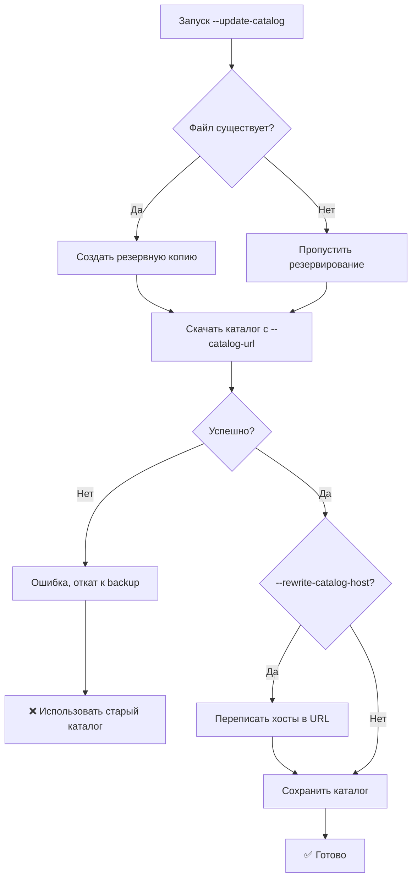
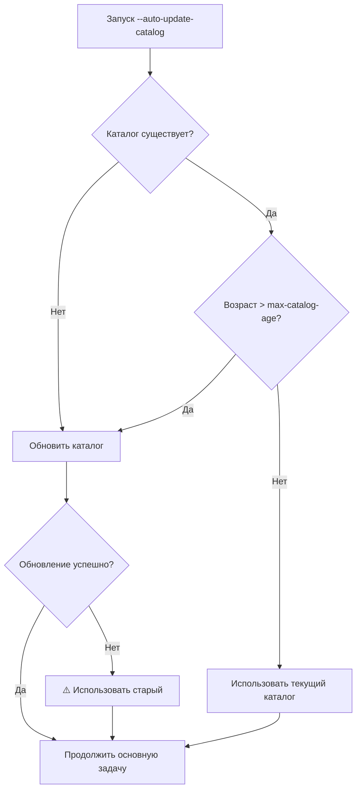
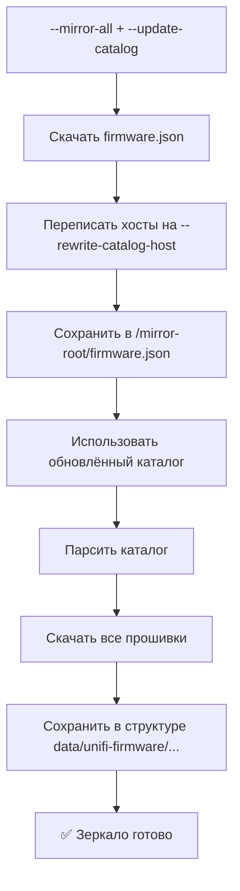
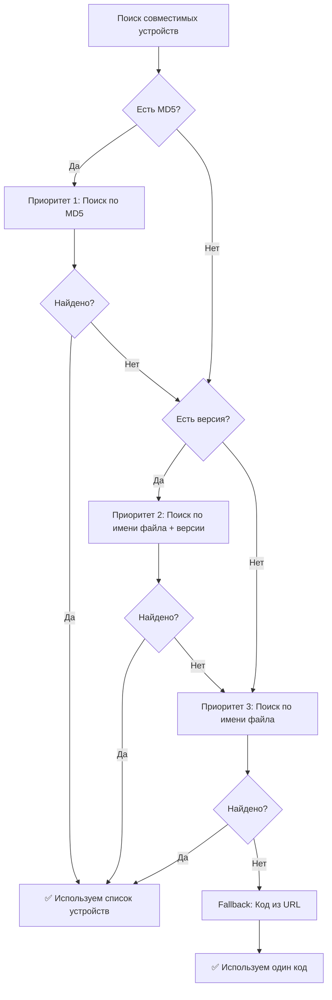

# 📋 Автоматическое обновление каталога firmware.json

> Полное руководство по обновлению каталога прошивок и созданию зеркал

## 📖 Содержание

- [Проблема](#-проблема)
- [Решение](#-решение)
- [Новые опции](#-новые-опции)
- [Переменные окружения](#-переменные-окружения)
- [Архитектура](#-архитектура)
- [Сценарии использования](#-сценарии-использования)
- [Примеры](#-примеры)
- [FAQ](#-faq)

---

## 🎯 Проблема

В изолированных сетях `/var/lib/unifi/firmware.json` быстро устаревает, и контроллер не может получить информацию о новых прошивках. Это создаёт проблемы:

1. **Устаревший каталог** - новые прошивки не видны в WebUI
2. **Нет доступа к интернету** - контроллер не может обновить каталог
3. **Ручное обновление** - трудоёмко и подвержено ошибкам
4. **Разные хосты загрузки** - официальный репозиторий может быть недоступен

---

## ✨ Решение

Скрипт теперь поддерживает **автоматическое обновление каталога** с:

- 🔄 Автоматической проверкой актуальности (по умолчанию 20 дней)
- 🌐 Скачиванием с произвольного источника (прокси, зеркало, официальный)
- 🔀 Подменой хостов в URL для работы с локальным зеркалом
- 💾 Безопасным обновлением с резервным копированием
- 🏗️ Интеграцией с режимом зеркала

---

## 🔧 Новые опции

```bash
--update-catalog              # Обновить firmware.json и выйти
--auto-update-catalog         # Автообновление при запуске (если устарел)
--catalog-url URL             # Источник каталога
                              # По умолчанию: https://fw-download.ubnt.com/data/firmware.json
--rewrite-catalog-host HOST   # Новый хост для замены в URL
                              # Например: fw-mirror.example.com
                              # Автоматически добавится https:// если не указан
--max-catalog-age DAYS        # Максимальный возраст каталога (по умолчанию: 20 дней)
--no-catalog-backup           # Не делать резервную копию при обновлении
```

---

## 🛠️ Переменные окружения

| Переменная | По умолчанию | Описание |
|------------|--------------|----------|
| `CATALOG_URL` | `https://fw-download.ubnt.com/data/firmware.json` | URL источника каталога |
| `MAX_CATALOG_AGE` | `20` | Максимальный возраст каталога в днях |
| `CATALOG_BACKUP` | `1` | Делать резервную копию (1=да, 0=нет) |
| `REWRITE_CATALOG_HOST` | - | Хост для замены в URL каталога |

### Пример использования переменных:

```bash
# Использовать каталог с вашего зеркала
CATALOG_URL=https://fw-mirror.example.com/firmware.json \
  sudo ./unifi-fw-cache.sh --from-catalog --codes "UAP6MP"

# Увеличить максимальный возраст каталога
MAX_CATALOG_AGE=30 \
  sudo ./unifi-fw-cache.sh --auto-update-catalog --from-catalog --codes "U7PG2"
```

---

## 🏗️ Архитектура

### Логика обновления каталога



### Логика автообновления



### Гибридный режим (зеркало + обновление)



---

## 🎯 Сценарии использования

### 📌 Сценарий 1: Обновление каталога на контроллере

**Задача:** Контроллер в изолированной сети, нужно обновлять каталог из локального зеркала.

**Решение:**

```bash
# В cron на контроллере (каждый день в 3:00)
0 3 * * * /opt/unifi-fw-cache.sh --update-catalog \
  --catalog-url https://fw-mirror.example.com/firmware.json \
  --rewrite-catalog-host fw-mirror.example.com \
  >> /var/log/unifi-catalog.log 2>&1
```

**Что происходит:**
1. ✅ Скачивает свежий `firmware.json` с вашего зеркала
2. ✅ Переписывает все URL: `https://dl.ui.com/...` → `https://fw-mirror.example.com/...`
3. ✅ Сохраняет в `/var/lib/unifi/firmware.json`
4. ✅ Контроллер в WebUI видит новые прошивки

**Результат:** Пользователь просто нажимает "Cache" в WebUI, и прошивки скачиваются с вашего зеркала.

---

### 📌 Сценарий 2: Создание зеркала с обновлённым каталогом

**Задача:** Создать полное зеркало UniFi прошивок с переписанными URL.

**Решение:**

```bash
# На бастион-хосте (fw-mirror.example.com)
# Каждое воскресенье в 2:00 обновлять зеркало
0 2 * * 0 /opt/unifi-fw-cache.sh \
  --update-catalog \
  --catalog-url https://fw-download.ubnt.com/data/firmware.json \
  --rewrite-catalog-host fw-mirror.example.com \
  --mirror-all \
  --mirror-root /srv/www/unifi-mirror \
  >> /var/log/unifi-mirror.log 2>&1
```

**Структура зеркала:**
```
/srv/www/unifi-mirror/
├── firmware.json                    # Каталог с переписанными хостами
└── data/
    └── unifi-firmware/
        ├── U7PG2/
        │   └── 6.7.35.15586/
        │       └── BZ.qca956x_6.7.35+15586.bin
        ├── UAP6MP/
        └── ...
```

**Веб-сервер (nginx):**
```nginx
server {
    listen 443 ssl;
    server_name fw-mirror.example.com;

    ssl_certificate /etc/ssl/certs/fw-mirror.example.com.crt;
    ssl_certificate_key /etc/ssl/private/fw-mirror.example.com.key;

    root /srv/www/unifi-mirror;

    location / {
        autoindex on;
    }
}
```

---

### 📌 Сценарий 3: Автообновление с проверкой возраста

**Задача:** Обновлять каталог только если он устарел (старше 20 дней).

**Решение:**

```bash
# Автоматическое обновление при запуске
sudo ./unifi-fw-cache.sh \
  --from-catalog \
  --auto-update-catalog \
  --max-catalog-age 20 \
  --catalog-url https://fw-mirror.example.com/firmware.json \
  --codes "UAP6MP U7PG2"
```

**Логика работы:**
1. Проверяет возраст `/var/lib/unifi/firmware.json`
2. Если старше 20 дней → обновляет
3. Если свежий → использует текущий
4. Скачивает прошивки для указанных устройств

---

### 📌 Сценарий 4: Создание зеркала через прокси

**Задача:** На машине с доступом к интернету через прокси создать зеркало.

**Решение:**

```bash
# На машине с прокси
export https_proxy=http://proxy:3128

./unifi-fw-cache.sh \
  --update-catalog \
  --catalog-url https://fw-download.ubnt.com/data/firmware.json \
  --rewrite-catalog-host mirror.company.local \
  --mirror-all \
  --mirror-root /mnt/usb/unifi-mirror

# Скопировать на бастион-хост
rsync -avz /mnt/usb/unifi-mirror/ bastion:/srv/www/unifi-mirror/
```

---

## 💡 Примеры

### Обновить каталог вручную

```bash
# Простое обновление
sudo ./unifi-fw-cache.sh --update-catalog

# С переписыванием хостов
sudo ./unifi-fw-cache.sh --update-catalog \
  --rewrite-catalog-host fw-mirror.example.com

# С пользовательским источником
sudo ./unifi-fw-cache.sh --update-catalog \
  --catalog-url https://fw-mirror.example.com/firmware.json

# Без резервной копии
sudo ./unifi-fw-cache.sh --update-catalog --no-catalog-backup
```

### Автообновление при скачивании прошивок

```bash
# Обновить каталог, если устарел, и скачать прошивки
sudo ./unifi-fw-cache.sh \
  --auto-update-catalog \
  --from-catalog \
  --codes "UAP6MP U7PG2 UAL6"

# С пользовательским возрастом
sudo ./unifi-fw-cache.sh \
  --auto-update-catalog \
  --max-catalog-age 30 \
  --from-catalog \
  --codes "U7PG2"
```

### Создание зеркала

```bash
# Простое зеркало
./unifi-fw-cache.sh --mirror-all --mirror-root /srv/mirror

# Зеркало с обновлённым каталогом
./unifi-fw-cache.sh \
  --update-catalog \
  --rewrite-catalog-host fw-mirror.example.com \
  --mirror-all \
  --mirror-root /srv/mirror

# Зеркало только для AP (фильтр)
./unifi-fw-cache.sh \
  --update-catalog \
  --rewrite-catalog-host fw-mirror.example.com \
  --mirror-all \
  --mirror-root /srv/mirror \
  --filter "^(UAP|U7)"
```

---

## ❓ FAQ

### Q: Что происходит при ошибке обновления каталога?

**A:** Скрипт использует старый каталог и продолжает работу. Вы увидите сообщение:
```
❌ Ошибка загрузки каталога, используется старый
⚠️ Не удалось обновить каталог, используется старый
```

### Q: Где хранятся резервные копии каталога?

**A:** В той же директории с меткой времени:
```bash
/var/lib/unifi/firmware.json.bak.20241219-150830
```

Вы можете отключить резервирование: `--no-catalog-backup`

### Q: Как работает подмена хостов?

**A:** Функция `rewrite_catalog_hosts()` использует `jq` для замены хоста во всех URL:

**Было:**
```json
{
  "url": "https://dl.ui.com/unifi/firmware/U7PG2/6.7.35.15586/file.bin"
}
```

**Стало:**
```json
{
  "url": "https://fw-mirror.example.com/unifi/firmware/U7PG2/6.7.35.15586/file.bin"
}
```

**Путь сохраняется полностью**, меняется только хост.

### Q: Можно ли указать HTTP вместо HTTPS?

**A:** Да, функция `normalize_host()` поддерживает оба варианта:

```bash
# Автоматически добавит https://
--rewrite-catalog-host fw-mirror.example.com

# Или явно укажите протокол
--rewrite-catalog-host http://fw-mirror.example.com
--rewrite-catalog-host https://fw-mirror.example.com
```

### Q: Как проверить возраст каталога?

**A:** Используйте команду:

```bash
# Возраст файла в днях
echo $(( ($(date +%s) - $(stat -c%Y /var/lib/unifi/firmware.json)) / 86400 )) дней

# Или используйте встроенную функцию
source unifi-fw-cache.sh
check_catalog_age /var/lib/unifi/firmware.json 20
```

### Q: Можно ли обновить только каталог без скачивания прошивок?

**A:** Да, используйте `--update-catalog` без других опций:

```bash
sudo ./unifi-fw-cache.sh --update-catalog
```

Скрипт обновит каталог и завершится.

### Q: Как настроить веб-сервер для зеркала?

**A:** Пример конфигурации nginx:

```nginx
server {
    listen 443 ssl http2;
    server_name fw-mirror.example.com;

    ssl_certificate /etc/ssl/certs/fw-mirror.example.com.crt;
    ssl_certificate_key /etc/ssl/private/fw-mirror.example.com.key;

    root /srv/www/unifi-mirror;

    # Каталог
    location = /firmware.json {
        add_header Content-Type application/json;
    }

    # Прошивки
    location /data/ {
        autoindex on;
    }

    # Логирование
    access_log /var/log/nginx/fw-mirror.example.com.access.log;
    error_log /var/log/nginx/fw-mirror.example.com.error.log;
}
```

### Q: Можно ли использовать переменные окружения в cron?

**A:** Да:

```bash
# /etc/cron.d/unifi-fw-cache
CATALOG_URL=https://fw-mirror.example.com/firmware.json
MAX_CATALOG_AGE=20

0 3 * * * root /opt/unifi-fw-cache.sh --update-catalog --rewrite-catalog-host fw-mirror.example.com
```

---

## 🎓 Приоритеты поиска совместимых устройств

Скрипт использует трёхуровневую систему поиска совместимых устройств:



**Результат:** Одна прошивка автоматически доступна для всех совместимых моделей!

---

## 🔐 Безопасность

### Проверка целостности

Скрипт проверяет валидность JSON перед сохранением:

```bash
# Проверить каталог вручную
jq empty /var/lib/unifi/firmware.json && echo "✅ Валидный JSON" || echo "❌ Ошибка"
```

### Резервное копирование

Перед обновлением создаётся резервная копия:

```bash
# Восстановить из резервной копии
cp /var/lib/unifi/firmware.json.bak.20241219-150830 /var/lib/unifi/firmware.json
```

### Права доступа

Скрипт автоматически устанавливает правильные права:

```bash
# Для режима контроллера
chown unifi:unifi /var/lib/unifi/firmware.json
chmod 0644 /var/lib/unifi/firmware.json
```

---

## 📊 Мониторинг

### Проверить актуальность каталога

```bash
# Возраст каталога
stat -c "%y" /var/lib/unifi/firmware.json

# Версия контроллера в каталоге
jq 'keys | max' /var/lib/unifi/firmware.json
```

### Проверить переписанные хосты

```bash
# Список уникальных хостов в каталоге
jq -r '.[][] .release | .[].url' /var/lib/unifi/firmware.json | \
  grep -oP 'https?://\K[^/]+' | sort -u
```

### Размер зеркала

```bash
# Размер всех файлов
du -sh /srv/www/unifi-mirror/

# Количество прошивок
find /srv/www/unifi-mirror/ -name "*.bin" -o -name "*.tar" | wc -l
```

---

<div align="center">

**✨ Теперь управление каталогом прошивок полностью автоматизировано! ✨**

Made with ❤️ for Network Engineers

</div>
