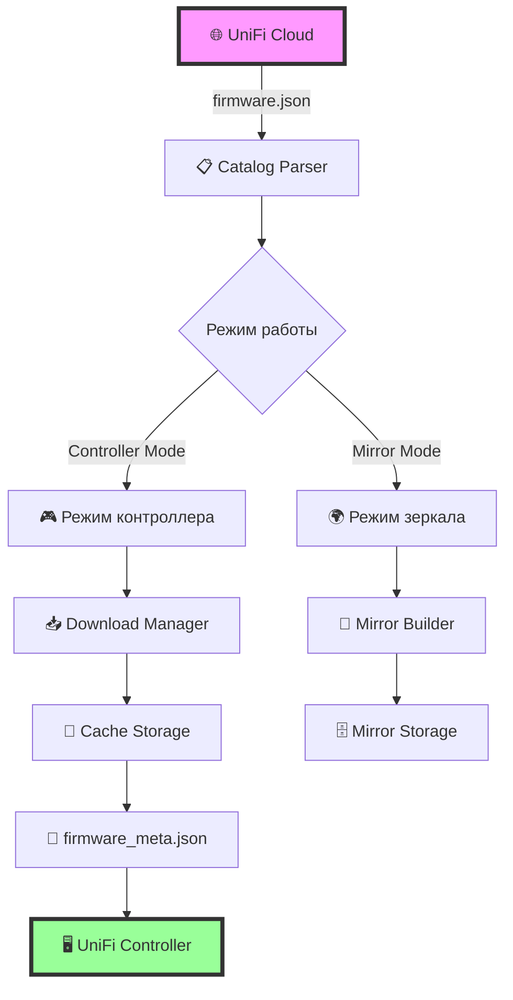
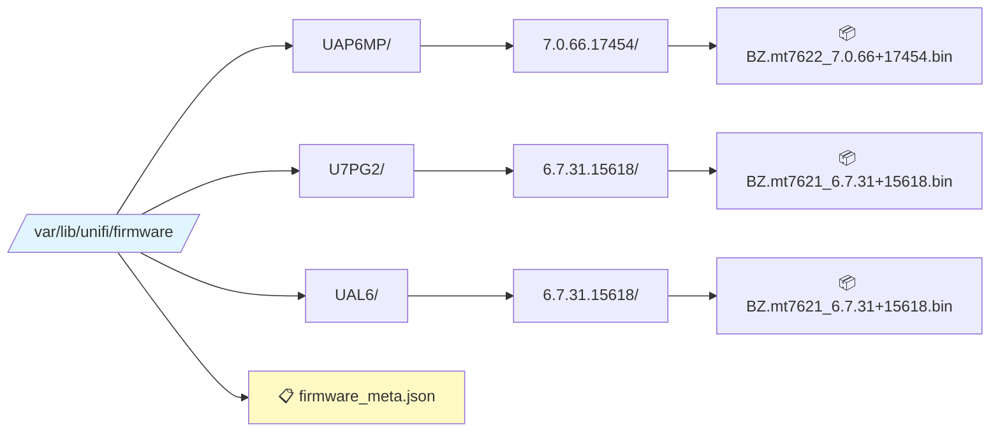
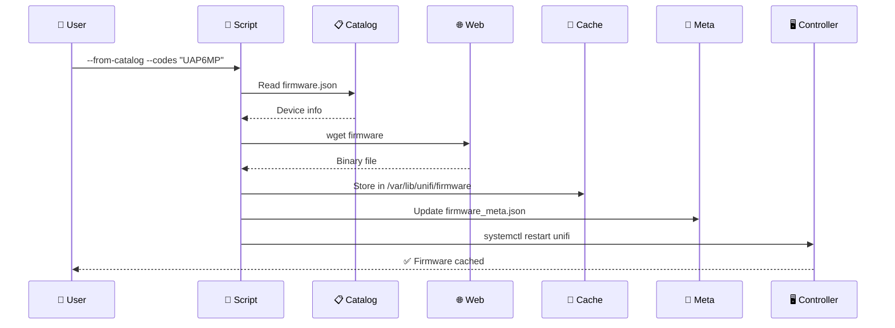
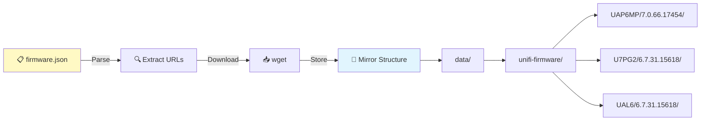

# 🚀 UniFi Firmware Cache Manager


> 💡 **Мощный инструмент для автоматизации управления прошивками UniFi в офлайн-среде**

## 📋 Содержание

- [🎯 Что это?](#-что-это)
- [✨ Возможности](#-возможности)
- [🏗️ Архитектура](#️-архитектура)
- [⚙️ Требования](#️-требования)
- [🚀 Быстрый старт](#-быстрый-старт)
- [📖 Режимы работы](#-режимы-работы)
- [🔧 Примеры использования](#-примеры-использования)
- [🌐 Работа с прокси](#-работа-с-прокси)
- [🛠️ Переменные окружения](#️-переменные-окружения)
- [🐛 Отладка](#-отладка)
- [📊 Мониторинг](#-мониторинг)
- [❓ FAQ](#-faq)

## 🎯 Что это?

**unifi-fw-cache** — это универсальный bash-скрипт для управления кэшем прошивок UniFi Network Controller. Идеальное решение для:

- 🔒 **Изолированных сетей** без доступа к интернету
- 🏢 **Корпоративных сред** с жесткими политиками безопасности
- 📦 **Массового развертывания** устройств UniFi
- 🌍 **Региональных зеркал** для ускорения обновлений

## ✨ Возможности

### 🎮 Режим контроллера
- 📥 Автоматическое скачивание прошивок из `firmware.json`
- 📂 Организация файлов в структурированное хранилище
- 🔄 Обновление `firmware_meta.json` для интеграции с UniFi
- 👤 Управление правами доступа (unifi:unifi)
- ♻️ Автоматический перезапуск службы

### 🌐 Режим зеркала
- 💾 Полное зеркалирование репозитория прошивок
- 🏗️ Создание локального хранилища fw-download.ubnt.com
- 🚀 Поддержка массового скачивания
- ✅ Проверка MD5-сумм

## 🏗️ Архитектура



### 📂 Структура кэша



## ⚙️ Требования

| Компонент | Версия | Описание |
|-----------|--------|----------|
| 🐚 **Bash** | 4.0+ | Используются массивы и process substitution |
| 🔧 **jq** | 1.5+ | Парсинг JSON каталога прошивок |
| 📥 **wget** | 1.14+ | Загрузка файлов с поддержкой докачки |
| 🔑 **md5sum** | - | Проверка целостности файлов |
| 📊 **coreutils** | 8.0+ | stat, install для управления файлами |
| ⚙️ **systemd** | - | Управление службой unifi (опционально) |
| 👑 **root** | - | Доступ к /var/lib/unifi |

## 🚀 Быстрый старт

### 1️⃣ Клонирование репозитория

```bash
git clone https://github.com/your-account/unifi-fw-cache.git
cd unifi-fw-cache
chmod +x unifi-fw-cache.sh
```

### 2️⃣ Базовое использование

```bash
# 🎯 Кэшировать прошивки для конкретных устройств
sudo ./unifi-fw-cache.sh --from-catalog --codes "UAP6MP U7PG2 UAL6"

# 📦 Добавить локальные файлы в кэш
sudo ./unifi-fw-cache.sh --src-dir ./firmware-files/

# 🌐 Создать полное зеркало
./unifi-fw-cache.sh --mirror-all --mirror-root /srv/unifi-mirror
```

## 📖 Режимы работы

### 🎮 Режим контроллера

Работа напрямую с кэшем UniFi Network Controller:



### 🌍 Режим зеркала

Создание локального зеркала всех прошивок:



## 🔧 Примеры использования

### 📥 Скачивание прошивок для конкретных моделей

```bash
# 🏢 Офисные точки доступа
sudo ./unifi-fw-cache.sh --from-catalog \
  --codes "UAP6MP UAP6LR U6MESH" \
  --app-version "9.0.131"
```

### 🔄 Использование внутреннего зеркала

```bash
# 🌐 Переопределение хоста загрузки
sudo REWRITE_HOST=mirror.local.lan \
  ./unifi-fw-cache.sh --from-catalog \
  --codes "U7PG2 UAL6"
```

### 📦 Офлайн установка из локальных файлов

```bash
# 💾 Файлы уже скачаны в папку firmware/
sudo ./unifi-fw-cache.sh --src-dir ./firmware/

# 📝 С указанием исходного URL для метаданных
sudo ./unifi-fw-cache.sh \
  --src-url "https://dl.ui.com/unifi/firmware/UAL6/6.7.31.15618/BZ.mt7621_6.7.31+15618.bin" \
  ./BZ.mt7621_6.7.31+15618.bin
```

### 🏗️ Создание полного зеркала

```bash
# 💿 Зеркалирование всех прошивок
./unifi-fw-cache.sh --mirror-all \
  --mirror-root /srv/unifi-mirror \
  --catalog ./firmware.json
```

### 🎯 Комбинированные сценарии

```bash
# 🚀 Скачать из каталога + добавить локальные файлы
sudo ./unifi-fw-cache.sh \
  --from-catalog --codes "UAP6MP" \
  --src-dir ./additional-firmware/ \
  https://dl.ui.com/unifi/firmware/U7PG2/special.bin
```

## 🌐 Работа с прокси

### 📡 Настройка wget для прокси

```bash
# HTTP прокси
export http_proxy=http://proxy.company.com:3128
export https_proxy=http://proxy.company.com:3128

# SOCKS5 прокси (требуется tsocks/proxychains)
proxychains ./unifi-fw-cache.sh --from-catalog --codes "UAP6MP"
```

### 🔀 Переопределение хоста загрузки

```bash
# Использовать внутреннее зеркало
REWRITE_HOST=unifi-mirror.local.lan \
  sudo -E ./unifi-fw-cache.sh --from-catalog --codes "UAP6MP"
```

## 🛠️ Переменные окружения

| Переменная | По умолчанию | Описание |
|------------|--------------|----------|
| 📁 `UNIFI_FW_DIR` | `/var/lib/unifi/firmware` | Директория кэша прошивок |
| 📋 `CATALOG` | `/var/lib/unifi/firmware.json` | Путь к каталогу прошивок |
| 🔢 `APP_VERSION` | auto | Версия контроллера (auto = последняя) |
| 👤 `UNIFI_USER` | `unifi` | Владелец файлов |
| 👥 `UNIFI_GROUP` | `unifi` | Группа файлов |
| ♻️ `RESTART` | `1` | Перезапускать службу (1/0) |
| 🌐 `REWRITE_HOST` | - | Заменить хост при загрузке |
| 📂 `MIRROR_ROOT` | `.` | Корень для режима зеркала |

### 💡 Примеры использования переменных

```bash
# 🔧 Кастомная директория кэша
UNIFI_FW_DIR=/opt/unifi-cache sudo ./unifi-fw-cache.sh --from-catalog --codes "UAP6MP"

# 🚫 Без перезапуска службы
RESTART=0 sudo ./unifi-fw-cache.sh --src-dir ./firmware/

# 📌 Фиксированная версия контроллера
APP_VERSION=8.5.6 sudo ./unifi-fw-cache.sh --from-catalog --codes "U7PG2"
```

## 🐛 Отладка

### 📝 Проверка логов

```bash
# 🔍 Логи контроллера UniFi
grep -i firmware_meta /usr/lib/unifi/logs/server.log | tail -n 50

# 📊 Статус службы
systemctl status unifi

# 🗂️ Проверка кэша
ls -la /var/lib/unifi/firmware/
cat /var/lib/unifi/firmware/firmware_meta.json | jq .
```

### 🔧 Режим отладки

```bash
# 🐞 Включить отладку bash
bash -x ./unifi-fw-cache.sh --from-catalog --codes "UAP6MP"

# 📋 Проверить содержимое каталога
jq '.["9.0.131"].release | keys' /var/lib/unifi/firmware.json
```

## 📊 Мониторинг

### 📈 Статистика кэша

```bash
# 📦 Размер кэша
du -sh /var/lib/unifi/firmware/

# 📋 Количество прошивок
find /var/lib/unifi/firmware -name "*.bin" -o -name "*.tar" | wc -l

# 🔍 Группировка по устройствам
for dir in /var/lib/unifi/firmware/*/; do
  device=$(basename "$dir")
  count=$(find "$dir" -name "*.bin" -o -name "*.tar" | wc -l)
  echo "📱 $device: $count firmware(s)"
done
```

### 🔄 Автоматизация через cron

```bash
# Добавить в crontab
# 🌙 Ежедневное обновление кэша в 3:00
0 3 * * * /opt/unifi-fw-cache/unifi-fw-cache.sh --from-catalog --codes "UAP6MP U7PG2 UAL6" >> /var/log/unifi-fw-cache.log 2>&1

# 📅 Еженедельное полное зеркалирование
0 2 * * 0 /opt/unifi-fw-cache/unifi-fw-cache.sh --mirror-all --mirror-root /srv/unifi-mirror >> /var/log/unifi-mirror.log 2>&1
```

## ❓ FAQ

### ❌ Контроллер не видит кэш

**Симптомы:** После выполнения скрипта прошивки не появляются в UI контроллера.

**Решение:**
```bash
# 1️⃣ Проверить права доступа
ls -la /var/lib/unifi/firmware/
chown -R unifi:unifi /var/lib/unifi/firmware/

# 2️⃣ Проверить формат firmware_meta.json
jq . /var/lib/unifi/firmware/firmware_meta.json

# 3️⃣ Перезапустить контроллер
systemctl restart unifi

# 4️⃣ Проверить логи
tail -f /usr/lib/unifi/logs/server.log
```

### 🔒 Ошибки доступа

**Симптомы:** Permission denied при записи файлов.

**Решение:**
```bash
# ✅ Запускать с sudo
sudo ./unifi-fw-cache.sh --from-catalog --codes "UAP6MP"

# 🔧 Или изменить переменные окружения
UNIFI_USER=$USER UNIFI_GROUP=$USER RESTART=0 ./unifi-fw-cache.sh ...
```

### 🌐 Проблемы с загрузкой

**Симптомы:** wget не может скачать файлы.

**Решение:**
```bash
# 🔍 Проверить доступность
wget --spider https://dl.ui.com/unifi/firmware/UAP6MP/7.0.66.17454/BZ.mt7622_7.0.66+17454.240913.0102.bin

# 🌐 Использовать прокси
export https_proxy=http://proxy:3128
sudo -E ./unifi-fw-cache.sh --from-catalog --codes "UAP6MP"

# 🔀 Или внутреннее зеркало
REWRITE_HOST=mirror.local ./unifi-fw-cache.sh --from-catalog --codes "UAP6MP"
```

### 📦 MD5 mismatch

**Симптомы:** Предупреждения о несовпадении контрольных сумм.

**Решение:**
```bash
# 🔄 Перекачать файл
rm /var/lib/unifi/firmware/UAP6MP/7.0.66.17454/*.bin
sudo ./unifi-fw-cache.sh --from-catalog --codes "UAP6MP"

# ✅ Проверить целостность вручную
md5sum /var/lib/unifi/firmware/UAP6MP/7.0.66.17454/*.bin
```

## 🤝 Вклад в проект

Приветствуются любые улучшения!

1. 🍴 Fork репозитория
2. 🌿 Создайте feature branch (`git checkout -b feature/AmazingFeature`)
3. 💾 Commit изменений (`git commit -m 'Add some AmazingFeature'`)
4. 📤 Push в branch (`git push origin feature/AmazingFeature`)
5. 🎯 Откройте Pull Request

## 📜 Лицензия

Распространяется под лицензией MIT. См. `LICENSE` для подробностей.

## 🙏 Благодарности

- 🏢 **Ubiquiti Networks** за UniFi
- 👥 **Сообщество UniFi** за тестирование и обратную связь
- 🛠️ **Разработчикам** bash, jq, wget за отличные инструменты

---

<div align="center">

**⭐ Если проект полезен, поставьте звезду на GitHub! ⭐**

Made with ❤️ for Network Engineers

</div>